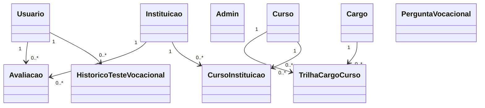

# UML — Classes de Domínio do LUME

```mermaid
classDiagram
  class Usuario
  class Instituicao
  class Admin
  class Curso
  class Cargo
  class TrilhaCargoCurso
  class CursoInstituicao
  class Avaliacao
  class PerguntaVocacional
  class HistoricoTesteVocacional

  Usuario "1" --> "0..*" Avaliacao
  Instituicao "1" --> "0..*" Avaliacao
  Usuario "1" --> "0..*" HistoricoTesteVocacional
  Cargo "1" --> "0..*" TrilhaCargoCurso
  Curso "1" --> "0..*" TrilhaCargoCurso
  Curso "1" --> "0..*" CursoInstituicao
  Instituicao "1" --> "0..*" CursoInstituicao
```

Os atributos completos e seus mapeamentos físicos estão em docs/software/01-uml-classes.md e docs/banco/02-dicionario-fisico.md.